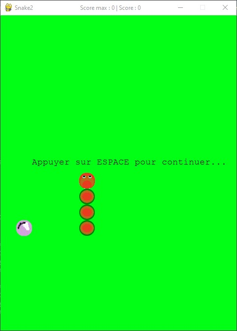

# PySnake



# How to install it

- First you need to install PyGame, a Python framework for creating 2d game

```bash
pip install pygame
```

- Clone the repository

```bash
git clone https://github.com/Toukoms/Py-snake.git
```

- go to the folder

```bash
cd Py-snake/src
```

- run the `main.py` file

```bash
py main
```

Enjoy it 😀
